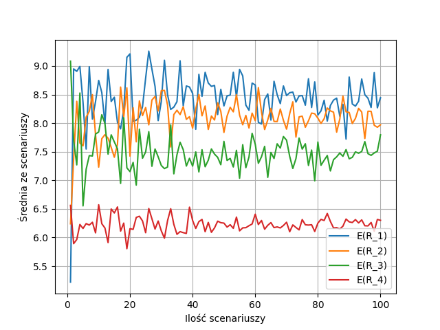
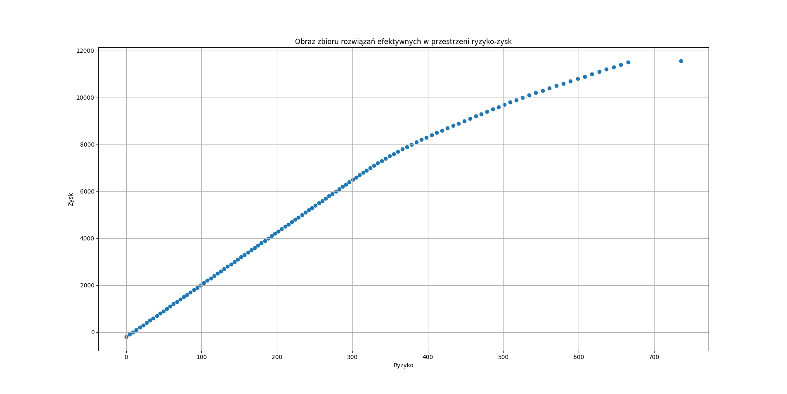
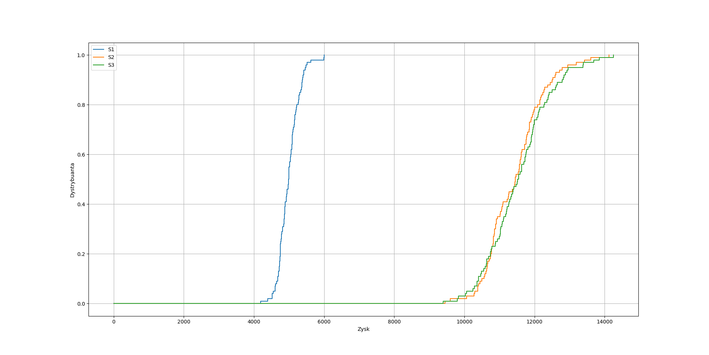
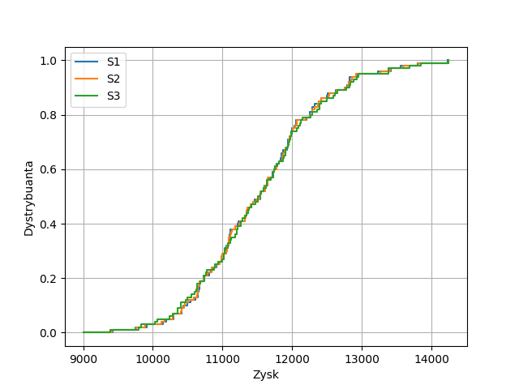

## Zadanie

#### Rozważamy następujące zagadnienie planowania produkcji:

Przedsiębiorstwo wytwarza 4 produkty $P_1, P_2, P_3, P_4$ na następujących maszynach: 

- 4 szlifierkach,
- 2 wiertarkach pionowych, 
- 3 wiertarkach poziomych, 
- 1 frezarce 
- 1 tokarce. 

Wymagane czasy produkcji 1 sztuki produktu (w godzinach) w danym procesie obróbki zostały przedstawione w poniższej tabeli:

proces            | P1   | P2   | P3   | P4
------------------|------|------|------|-----
Szlifowanie       | 0.4  | 0.6  | -    | -
Wiercenie pionowe | 0.2  | 0.1  | -    | 0.6
Wiercenie poziome | 0.1  | -    | 0.7  | -
Frezowanie        | 0.06 | 0.04 | -    | 0.05
Toczenie          | -    | 0.05 | 0.02 | -

Dochody ze sprzedaży produktów (w zł/sztukę) modelują składowe wektora losowego $R = (R_1, R_2, R_3, R_4)^T$ . Wektor losowy $R$ opisuje 4-wymiarowy rozkład t-Studenta z 4 stopniami swobody, którego wartości składowych zostały zawężone do przedziału $[5; 12]$. Parametry $\mu$ oraz $\Sigma$ niezawężonego rozkładu t-Studenta są następujące:

$$
\mu = 
    \begin{bmatrix}
        9 \\
        8 \\
        7 \\
        6
    \end{bmatrix}
$$
$$
\Sigma = 
    \begin{bmatrix}
        16 & -2 & -1 & -3 \\
        -2 &  9 & -4 & -1 \\
        -1 & -4 &  4 &  1 \\
        -3 & -1 &  1 &  1
    \end{bmatrix}
$$

Istnieją ograniczenia rynkowe na liczbę sprzedawanych produktów w danym miesiącu:

miesiąc | P1  | P2  | P3  | P4
--------|-----|-----|-----|----
Styczeń | 200 | 0   | 100 | 200
Luty    | 300 | 100 | 200 | 200
Marzec  | 0   | 300 | 100 | 200

Jeżeli w danym miesiącu jest sprzedawany produkt $P_1$ lub $P_2$, to musi być również sprzedawany produkt $P_4$ w liczbie sztuk nie mniejszej niż suma sprzedawanych produktów $P_1$ i $P_2$.

Istnieje możliwość składowania do 200 sztuk każdego produktu w danym czasie w cenie
1 zł/sztukę za miesiąc. Aktualnie firma nie posiada żadnych zapasów, ale jest pożądane mieć po 50 sztuk każdego produktu pod koniec marca.

Przedsiębiorstwo pracuje 6 dni w tygodniu w systemie dwóch zmian. Każda zmiana trwa 8 godzin. Można założyć, że każdy miesiąc składa się z 24 dni roboczych.

---

1. Zaproponować jednokryterialny model wyboru w warunkach ryzyka z wartością średnią jako miarą zysku. Wyznaczyć rozwiązanie optymalne.

2. Jako rozszerzenie powyższego zaproponować dwukryterialny model zysku i ryzyka z wartością średnią jako miarą zysku i odchyleniem przeciętnym jako miarą ryzyka. Dla decyzji $x \in Q$ odchylenie przeciętne jest definiowane jako $\delta(x) = \sum_{t=1}^{T}|\mu(x)-r_t(x)|p_t$, gdzie $\mu(x)$ oznacza wartość średnią, $r_t(x)$ realizację dla scenariusza $t$, $p_t$ prawdopodobieństwo scenariusza $t$.
    - Wyznaczyć obraz zbioru rozwiązań efektywnych w przestrzeni ryzyko–zysk.
    - Wskazać rozwiązania efektywne minimalnego ryzyka i maksymalnego zysku. Jakie odpowiadają im wartości w przestrzeni ryzyko–zysk?
    - Wybrać trzy dowolne rozwiązania efektywne. Sprawdzić czy zachodzi pomiędzy nimi relacja dominacji stochastycznej pierwszego rzędu. Wyniki skomentować, odnieść do ogólnego przypadku.

\newpage

# Jednokryterialny model wyboru w warunkach ryzyka z wartością średnią jako miarą zysku

## Analityczne sformułowanie modelu

Model jednokryterialny ma za zadanie opisać proces produkcyjny przedsiębiorstwa. Pozwoli on na optymalizację zysków z produkcji, zarządzanie sprzedażą oraz efektywne magazynowanie produktów.

Dochody ze sprzedaży produktów modelują składowe wektora losowego $R$. W przypadku jednokryterialnego modelu wyboru w warunkach ryzyka bazującym na maksymalizacji wartości oczekiwanej zysku możemy przyjąć oczekiwane dochody ze sprzedaży poszczególnych produktów jako oczekiwane wartości wektora $R$.

Ze względu, że suma jest funkcją liniową, wartość oczekiwana sumy jest równa sumie wartości oczekiwanych. Pozwala to na wyliczenie całkowitego zysku jako sumę oczekiwanych wartości zysków ze sprzedaży produktów w czasie pomniejszoną o sumaryczne oczekiwane koszty magazynowania produktów.

### Wartość oczekiwana zawężonego rozkładu t-Studenta wektora losowego $R$

Zmienna losowa $R$ ma niestandardowy rozkład t-Studenta z 4 stopniami swobody zawężony do przedziału $[5; 12]$. 
Rozkład t-Studenta jest ciągły, więc wartość oczekiwana na przedziale domkniętym jest taka sama jak na przedziale otwartym.
Wartości oczekiwane wektora $R$ zostały policzone ze wzoru:

$$
E(R) = \mu + \sigma \frac{\Gamma((v-1)/2)((v+a^2)^{-(v-1)/2}-(v+b^2)^{-(v-1)/2})v^{v/2}}{2(F_v(b)-F_v(a))\Gamma(v/2)\Gamma(1/2)}
dla\ v > 1
$$

gdzie:

- $\Gamma(.)$ - funkcja gamma Eulera,
- $\mu$ - wartość oczekiwana niezawężonego rozkładu t-Studenta:

$$
\mu = 
    \begin{bmatrix}
        9 \\
        8 \\
        7 \\
        6
    \end{bmatrix}
$$

- $\Sigma$ - macierz kowariancji niezawężonego rozkładu t-Studenta:

$$
\Sigma = 
    \begin{bmatrix}
        16 & -2 & -1 & -3 \\
        -2 &  9 & -4 & -1 \\
        -1 & -4 &  4 &  1 \\
        -3 & -1 &  1 &  1
    \end{bmatrix}
$$

- $\alpha = 5$ - lewy kraniec przedziału,
- $\beta = 12$ - prawy kraniec przedziału,

- $R_i$ - rozkłady poszczególnych składowych wektora $R$:

$$
R_1 \sim Tt_{(5;12)}(9, 16; 4)
$$
$$
R_2 \sim Tt_{(5;12)}(8, 9; 4)
$$
$$
R_3 \sim Tt_{(5;12)}(7, 4; 4)
$$
$$
R_4 \sim Tt_{(5;12)}(6, 1; 4)
$$

- $a = \frac{\alpha - \mu}{\sigma},\ b = \frac{\beta - \mu}{\sigma}$

\newpage

Wyliczona wartość oczekiwana rozkładu wartości po podstawieniu do wzoru:

$$
E(R_1) = 8.6274568376001
$$
$$
E(R_2) = 8.304864144322744
$$
$$
E(R_3) = 7.605077266035032
$$
$$
E(R_4) = 6.421595377441505
$$

Ostatecznie wychodzi, że oczekiwane dochody ze sprzedaży poszczególnych produktów wynoszą odpowiednio:

produkt | oczekiwany dochód ze sprzedaży
--------|-------------------------------
P1      | 8.6274568376001 zł/sztukę
P2      | 8.304864144322744 zł/sztukę
P3      | 7.605077266035032 zł/sztukę
P4      | 6.421595377441505 zł/sztukę

\newpage

## Specyfikacja problemu decyzyjnego

<!-- Specyfikacja problemu decyzyjnego z dookreśleniem wszystkich elementów. -->
<!-- Określenie zmiennych decyzyjnych, ograniczeń i funkcji oceny. -->

Przyjęta konwencja:

- UPPER_CASE - nazewnictwo zbiorów i stałych parametrów,
- snake_case - nazewnictwo zmiennych decyzyjnych,
- pojedyncze litery - nazewnictwo poszczególnych elementów należących do zbioru.


### Dostępne zbiory

- $PRODUCTS = \{P_1, P_2, P_3, P_4\}$ - zbiór produktów,
- $PROCESSES$ - zbiór procesów,
$$
PROCESSES = \{szlifowanie, wiercenie\_pionowe, wiercenie\_poziome, frezowanie, toczenie\}
$$

- $MONTHS = \{styczeń, luty, marzec\}$ - zbiór dostępnych miesięcy,
- $MONTH\_PREDECESSORS = \{(grudzień, styczeń), (styczeń, luty), (luty, marzec)\}$ - zbiór miesięcy oraz ich poprzedników.

### Parametry

- $HOURS\_IN\_A\_SHIFT = 8$ - zmiany trwają po 8h,
- $NUMBER\_OF\_SHIFTS = 2$ - przedsiębiorstwo pracuje w systemie dwóch zmian,
- $WORKING\_DAYS\_IN\_A\_MONTH = 24$ - każdy miesiąc składa się z 24 dni roboczych,
- $WORKING\_HOURS\_IN\_A\_MONTH = 384$ - całkowita liczba przepracowanych godzin w miesiącu,
$$
WORKING\_HOURS\_IN\_A\_MONTH = 
$$
$$
HOURS\_IN\_A\_SHIFT \cdot NUMBER\_OF\_SHIFTS \cdot WORKING\_DAYS\_IN\_A\_MONTH
$$

- $PRODUCT\_STORAGE\_LIMIT = 200$ - przedsiębiorstwo ma możliwość składowania do 200 sztuk każdego produktu,
- $MONTHLY\_PRODUCT\_STORAGE\_COST = 1$ - cena składowania produktu to 1 zł/sztukę,
- $PRODUCT\_MINIMAL\_LEFT\_OVER = 50$ - pożądany zapas każdego produktu pod koniec marca to 50 produktów,
- $PROCESS\_TOOLS[p]\ dla\ p \in PROCESSES$ - liczba maszyn pozwalających na równoległe wytwarzanie w ramach danego procesu $p$:

$p \in PROCESSES$ | $PROCESS\_TOOLS[p]$
------------------|--------------------
szlifowanie       | 4
wiercenie_pionowe | 2
wiercenie_poziome | 3
frezowanie        | 1
toczenie          | 1

\newpage

- $PRODUCTION\_TIME[i][p]\ dla\ p \in PRODUCTS,\ i \in PROCESSES$ - wymagany czas produkcji 1 sztuki produktu (w godzinach) w danym procesie obróbki:

$PRODUCTION\_TIME[i][p]$ | P1   | P2   | P3   | P4
-------------------------|------|------|------|-----
szlifowanie              | 0.4  | 0.6  | -    | -
wiercenie_pionowe        | 0.2  | 0.1  | -    | 0.6
wiercenie_poziome        | 0.1  | -    | 0.7  | -
frezowanie               | 0.06 | 0.04 | -    | 0.05
toczenie                 | -    | 0.05 | 0.02 | -

- $EXPECTED\_INCOME\_PER\_PRODUCT[p]\ dla \ p \in PRODUCTS$ - średni dochód ze sprzedaży produktów (w zł/sztukę):

$p \in PRODUCTS$ | $EXPECTED\_INCOME\_PER\_PRODUCT[p]$
-----------------|------------------------------------
P1               | $E(R_1)$
P2               | $E(R_2)$
P3               | $E(R_3)$
P4               | $E(R_4)$

- $SELL\_LIMIT[m][p]\ dla\ p \in PRODUCTS,\ m \in MONTHS$ - ograniczenia rynkowe na liczbę sprzedawanych produktów w danym miesiącu:

$SELL\_LIMIT$ | P1  | P2  | P3  | P4
--------------|-----|-----|-----|----
styczen       | 200 | 0   | 100 | 200
luty          | 300 | 100 | 200 | 200
marzec        | 0   | 300 | 100 | 200

### Zmienne decyzyjne

- $production[p][m]\ dla\ p \in PRODUCTS,\ m \in MONTHS$ - ilość danego produktu $p$ wytworzona w ciągu miesiąca $m$,
- $sale[p][m]\ dla\ p \in PRODUCTS,\ m \in MONTHS$ - oczekiwana ilość produktu $p$, która powinna zostać sprzedana w ciągu miesiąca $m$,
- $left\_over[p][m]\ dla\ p \in PRODUCTS,\ m \in MONTHS \cup \{grudzień\}$ - ilość produktu $p$, która pozostanie w magazynie na koniec miesiąca $m$,
- $income$ - zmienna reprezentująca oczekiwany całkowity dochód. Dodanie tej zmiennej pozwala na uproszczenie funkcji oceny.

### Ograniczenia

- Czas produkcji wszystkich przedmiotów w miesiącu nie może przekroczyć dostępności maszyn w miesiącu:
$$
\forall{m \in MONTHS,\ i \in PROCESSES}: 
$$
$$
\sum_{p \in PRODUCTS}\ (production[p][m] \cdot PRODUCTION\_TIME[i][p]) \le 
$$
$$
WORKING\_HOURS\_IN\_A\_MONTH \cdot PROCESS\_TOOLS[i]
$$

- Pozostałości ze sprzedaży są różnicą sumy produktów przechowywanych z poprzedniego miesiąca, produktów wyprodukowanych oraz sprzedanych:
$$
\forall{(s, c) \in MONTH\_PREDECESSORS,\ p \in PRODUCTS}:
$$
$$
left\_over[p][c] = production[p][c] + left\_over[p][s] - sale[p][c]
$$

- Firma na początku stycznia nie posiada żadnych zapasów, więc pozostałości przedmiotów z grudnia są równe 0:
$$
\forall{p \in PRODUCTS}:\ left\_over[p][grudzień] = 0
$$

- Oczekiwanym dochodem całkowitym jest suma wartości oczekiwanych ze sprzedaży poszczególnych produktów w różnych miesiącach pomniejszonym o sumaryczne koszty magazynowania produktów w tym czasie:
$$
income =\sum_{p \in PRODUCTS,\ m \in MONTHS}
$$
$$
(sale[p][m] \cdot EXPECTED\_INCOME\_PER\_PRODUCT[p] - 
$$
$$
left\_over[p][m] \cdot MONTHLY\_PRODUCT\_STORAGE\_COST)
$$

- Ograniczenia rynkowe na liczbę sprzedawanych produktów w danym miesiącu nie mogą zostać przekroczone:
$$
\forall{p \in PRODUCTS,\ m \in MONTHS}:\ sale[p][m] \le SELL\_LIMIT[m][p]
$$

- Produkt $P_4$ w danym miesiącu musi być sprzedawany w liczbie sztuk nie mniejszej niż suma sprzedawanych produktów $P_1$ i $P_2$:
$$
\forall{m \in MONTHS}:\ sale[P_4][m] \ge sale[P_1][m] + sale[P_2][m]
$$

- Istnieje możliwość składowania do $PRODUCT\_STORAGE\_LIMIT$ sztuk każdego produktu na koniec miesiąca:
$$
\forall{p \in PRODUCTS,\ m \in MONTHS}:\ left\_over[p][m] \le PRODUCT\_STORAGE\_LIMIT
$$

- Pożądane jest, aby pod koniec marca firma posiadała po $PRODUCT\_MINIMAL\_LEFT\_OVER$ sztuk każdego produktu:
$$
\forall{p \in PRODUCTS}:\ left\_over[p][marzec] \ge PRODUCT\_MINIMAL\_LEFT\_OVER
$$

- Produkcja poszczególnych produktów w miesiącu nie może być negatywna:
$$
\forall{p \in PRODUCTS,\ m \in MONTHS}:\ production[p][m] \ge 0
$$

- Sprzedaż poszczególnych produktów w miesiącu nie może być negatywna:
$$
\forall{p \in PRODUCTS,\ m \in MONTHS}:\ sale[p][m] \ge 0
$$

- Pozostałości w magazynach na koniec miesiąca nie mogą być negatywne:
$$
\forall{p \in PRODUCTS,\ m \in MONTHS}:\ left\_over[p][m] \ge 0
$$

- Produkty są niepodzielne - produkcja, sprzedaż i pozostałości muszą być całkowitoliczbowe:
$$
\forall{p \in PRODUCTS,\ m \in MONTHS}:\ production[p][m] \in \mathbb{N}
$$

$$
\forall{p \in PRODUCTS,\ m \in MONTHS}:\ sale[p][m] \in \mathbb{N}
$$

$$
\forall{p \in PRODUCTS,\ m \in MONTHS}:\ left\_over[p][m] \in \mathbb{N}
$$

gdzie, $\mathbb{N}$ - zbiór liczb naturalnych.

### Funkcja oceny

Firma chce osiągnąć największy oczekiwany zysk. Maksymalizujemy oczekiwany dochód z produkcji, zatem funkcją oceny jest: 
$$
max(income)
$$

## Sformułowanie modelu

<!-- Sformułowanie modelu w postaci do rozwiązania z wykorzystaniem wybranego narzędzie/środowiska implementacji (kompletny kod źródłowy). -->
<!-- Polecane narzędzia: -->
<!-- - optymalizacja: AMPL, CPLEX (biblioteki) -->
<!-- - statystyka: R, MATLAB -->

Implementacja modelu jednokryterialnego została przygotowana z wykorzystaniem języka AMPL oraz biblioteki CPLEX.

Wszelkie ograniczenia, parametry, zmienne decyzyjne i funkcje oceny zostały zdefiniowane w ramach pliku $task.mod$:

```py
set PRODUCTS;
set PROCESSES;
set MONTHS;
set MONTHS_WITH_DECEMBER;
set ALL_MONTHS;
set MONTH_PREDECESSORS within MONTHS_WITH_DECEMBER cross MONTHS;

param WORKING_HOURS_IN_A_MONTH;
param PRODUCT_STORAGE_LIMIT;
param MONTHLY_PRODUCT_STORAGE_COST;
param PRODUCT_MINIMAL_LEFT_OVER;

param PROCESS_TOOLS{p in PROCESSES};

param PRODUCTION_TIME{i in PROCESSES, p in PRODUCTS};

param EXPECTED_INCOME_PER_PRODUCT{p in PRODUCTS};

param SELL_LIMIT{m in MONTHS, p in PRODUCTS};

#############################################################################

# Produkcja nie może być negatywna:
var production{p in PRODUCTS, m in MONTHS} integer >= 0;

# Sprzedaż nie może być negatywna:
var sale{p in PRODUCTS, m in MONTHS} integer >= 0;

# Pozostałości w magazynach nie mogą być negatywne:
var left_over{p in PRODUCTS, m in ALL_MONTHS} integer >= 0;

var income;

#############################################################################

# Czas produkcji wszystkich przedmiotów w miesiącu nie może przekroczyć 
# dostępności maszyn w miesiącu:
subject to production_time_constraint{m in MONTHS, i in PROCESSES}:
	sum{p in PRODUCTS} 
		(production[p, m] * PRODUCTION_TIME[i, p]) 
		<= WORKING_HOURS_IN_A_MONTH * PROCESS_TOOLS[i];

# Pozostałości ze sprzedaży są różnicą sumy produktów przechowywanych 
# z poprzedniego miesiąca i wyprodukowanych oraz sprzedanych:
subject to left_over_constraint{(s, c) in MONTH_PREDECESSORS, p in PRODUCTS}:
	left_over[p, c] = production[p, c] + left_over[p, s] - sale[p, c];

# Firma na początku stycznia nie posiada żadnych zapasów, 
# więc pozostałości przedmiotów z grudnia są równe 0:
subject to december_left_over_constraint{p in PRODUCTS}:
	left_over[p, "grudzien"] = 0;

# Dochodem całkowitym jest różnica dochodu ze sprzedaży oraz kosztu 
# magazynowania:
subject to income_constraint:
	income = sum{p in PRODUCTS, m in MONTHS} (
		sale[p, m] * EXPECTED_INCOME_PER_PRODUCT[p] 
		- left_over[p, m] * MONTHLY_PRODUCT_STORAGE_COST
	);

# Ograniczenia rynkowe na liczbę sprzedawanych produktów 
# w danym miesiącu nie mogą być przekroczone:
subject to sale_limit_constraint{p in PRODUCTS, m in MONTHS}:
	sale[p, m] <= SELL_LIMIT[m, p];
	
# Produkt P4 musi być sprzedawany w liczbie sztuk nie mniejszej 
# niż suma sprzedawanych produktów P1 i P2:
subject to product_sell_limit_constraint{m in MONTHS}:
	sale["P4", m] >= sale["P1", m] + sale["P2", m];
	
# Istnieje możliwość składowania do PRODUCT_STORAGE_LIMIT 
# sztuk każdego produktu:
subject to product_storage_limit_constraint{p in PRODUCTS, m in MONTHS}:
	left_over[p, m] <= PRODUCT_STORAGE_LIMIT;

# Pożądane jest, aby pod koniec marca firma posiadała 
# po PRODUCT_MINIMAL_LEFT_OVER sztuk każdego produktu pod koniec marca:
subject to product_minimal_left_over_constraint{p in PRODUCTS}:
	left_over[p, "marzec"] >= PRODUCT_MINIMAL_LEFT_OVER;

#############################################################################

maximize max_income:
	income;
```

Dane z zadania zostały umieszczone w pliku $parameters.mod$:

```py
data;

set PRODUCTS := P1 P2 P3 P4;
set PROCESSES := szlifowanie wiercenie_pionowe wiercenie_poziome frezowanie toczenie;
set MONTHS = styczen luty marzec;
set MONTHS_WITH_DECEMBER = grudzien styczen luty;
set ALL_MONTHS = grudzien styczen luty marzec;
set MONTH_PREDECESSORS := (grudzien, styczen) (styczen, luty) (luty, marzec);

param WORKING_HOURS_IN_A_MONTH := 384;
param PRODUCT_STORAGE_LIMIT := 200;
param MONTHLY_PRODUCT_STORAGE_COST := 1;
param PRODUCT_MINIMAL_LEFT_OVER := 50;

param PROCESS_TOOLS :=
	szlifowanie       4,
	wiercenie_pionowe 2,
	wiercenie_poziome 3,
	frezowanie        1,
	toczenie          1;

param PRODUCTION_TIME 
	:                 P1   P2   P3   P4   :=
	szlifowanie       0.4  0.6  0    0
	wiercenie_pionowe 0.2  0.1  0    0.6
	wiercenie_poziome 0.1  0    0.7  0
	frezowanie        0.06 0.04 0    0.05
	toczenie          0    0.05 0.02 0    ;

param EXPECTED_INCOME_PER_PRODUCT :=
	P1 8.6274568376001   ,
	P2 8.304864144322744 ,
	P3 7.605077266035032 ,
	P4 6.421595377441505 ;

param SELL_LIMIT 
	:        P1   P2   P3   P4  :=
	styczen  200  0    100  200
	luty     300  100  200  200
	marzec   0    300  100  200 ;

end;
```

Do uruchamiania modelu został przygotowany oddzielny plik $task.run$:

```py
reset;

model task.mod;
data parameters.dat;

option solver cplex;
solve;

display production;
display sale;
display left_over;
display income;
```

Wartości oczekiwane rozkładu zostały wyliczone za pomocą skryptu bazującego na udostępnionym nam dokumencie $wo\_tStudent.pdf$:

```py
from math import gamma, sqrt
from scipy.stats import t
from typing import Callable

def calculate_expected_value_for_truncated_t_student_distribution(
    mu: float,
    sigma: float,
    v: float,
    alpha: float,
    beta: float
) -> float:
    f_v: Callable[[float], float] = lambda x: t(v).cdf(x)  # type: ignore
    a = (alpha - mu) / sigma
    b = (beta - mu) / sigma
    exponent = -(v - 1) / 2
    return (
        mu + sigma * (
            gamma((v - 1) / 2)
            * ((v + a**2)**exponent - (v + b**2)**exponent)
            * (v**(v/2))
        ) / (
            2
            * (f_v(b) - f_v(a))  # type: ignore
            * gamma(v / 2)
            * gamma(1 / 2)
        )
    )

mu = [9, 8, 7, 6]

SIGMA = [
    [16, -2, -1, -3],
    [-2, 9, -4, -1],
    [-1, -4, 4, 1],
    [-3, -1, 1, 1],
]

LOWER = 0
UPPER = 1
BOUNDS = [5, 12]

DEGREES_OF_FREEDOM = 4

if __name__ == '__main__':
    for i, row in enumerate(SIGMA):
        sigma = sqrt(SIGMA[i][i])
        expected = calculate_expected_value_for_truncated_t_student_distribution(
            mu=mu[i],
            sigma=sigma,
            v=DEGREES_OF_FREEDOM,
            alpha=BOUNDS[LOWER],
            beta=BOUNDS[UPPER]
        )
        print(f"E(R_{i+1}) = {expected}")
```

## Testy poprawności implementacji

W celu weryfikacji poprawności rozwiązania zostały zweryfikowane ograniczenia z zadania po podstawieniu wartości zmiennych decyzyjnych otrzymanych dla tego rozwiązania efektywnego.

1. Ilości produkcji nie przekraczają ograniczeń rynkowych.
2. Sprzedaż produktu $P_4$ jest większa niż suma produktów $P_1$ i $P_2$.
3. Składowanie przedmiotów w magazynie nie przekracza 200 przedmiotów.
4. Firma na koniec marca posiada w magazynie po 50 sztuk każdego z przedmiotów.
5. Czas produkcji przedmiotów nie przekracza dostępności maszyn w miesiącu.
6. Na początku stycznia (pod koniec grudnia) magazyny są puste.
7. W danym miesiącu sprzedaż oraz ilość towaru magazynowana na koniec miesiąca jest równa sumie produkcji i towarów magazynowanych.

Następnie, by dalej zweryfikować poprawność modelu został on uruchomiony na bazie różnych zmodyfikowanych danych np.
testowano magazynowanie produktów - została obniżona ilość dostępnego czasu pracy na maszynach oraz został obniżony do zera limit sprzedaży produktów w styczniu. W rezultacie w styczniu wszystkie produkty wytworzone trafiły do magazynów w celu sprzedaży w kolejnym miesiącu.

## Wyniki

<!-- Omówienie wyników z nawiązaniem do teorii. -->

Znalezione rozwiązanie efektywne prowadzi do oczekiwanego zysku równego 11806.90 zł.

Zmienne decyzyjne dla tego rozwiązania wynoszą odpowiednio:

- Produkcja:

production | P1  | P2  | P3  | P4
-----------|-----|-----|-----|----
styczen    | 200 | 0   | 100 | 200
luty       | 200 | 0   | 200 | 200
marzec     | 50  | 250 | 150 | 250

- Sprzedaż:

sale    | P1  | P2  | P3  | P4
--------|-----|-----|-----|----
styczen | 200 | 0   | 100 | 200
luty    | 200 | 0   | 200 | 200
marzec  | 0   | 200 | 100 | 200

- Magazynowane produkty pod koniec miesiąca:

left_over | P1 | P2 | P3 | P4
----------|----|----|----|---
grudzien  | 0  | 0  | 0  | 0
styczen   | 0  | 0  | 0  | 0
luty      | 0  | 0  | 0  | 0
marzec    | 50 | 50 | 50 | 50

Można zauważyć, że dla tak zdefiniowanych danych nie opłaca się magazynowanie produktów między kolejnymi miesiącami. Magazynowanie na koniec marca wynika jedynie z konieczności spełnienia ograniczenia.

\newpage

# Dwukryterialny model zysku i ryzyka z wartością średnią jako miarą zysku i odchyleniem przeciętnym jako miarą ryzyka

## Analityczne sformułowanie modelu

<!-- Wskazanie i uzasadnienie przyjętych założeń. -->
<!-- Wskazanie podstaw teoretycznych. -->

Model dwukryterialny został utworzony na bazie modelu jednokryterialnego. Przy rozwiązywaniu kolejnych podpunktów zostały zastosowane dwa sposoby optymalizacji rozwiązania:

- maksymalizacja średniego zysku przy ustalonym maksymalnym poziomie ryzyka,
- minimalizacja ryzyka przy ustalonym minimalnym poziomie oczekiwanego zysku.

Zastosowane metody dla poszczególnych podpunktów są lepiej opisane w sekcji $Wyniki$.

Model dwukryterialny bazuje na dwóch kryteriach:

- oczekiwanej wartości dochodu - miara zysku,
- odchyleniu przeciętnym wartości oczekiwanej dla poszczególnych realizacji scenariuszy od wartości średniej - miara ryzyka.

Miarę ryzyka możemy wyliczyć ze wzoru:
$$
\delta(x) = \sum_{t=1}^{T}|\mu(x)-r_t(x)|p_t
$$

gdzie:

- $\mu(x)$ - wartość średnia,
- $r_t(x)$ - realizacja scenariusza $t$,
- $p_t$ - prawdopodobieństwo scenariusza $t$.

W celu zamodelowania rozwiązania zostało wygenerowane 100 jednakowo prawdopodobnych scenariuszy z zadanego rozkładu zmiennej losowej $R$. Generacja jednakowo prawdopodobnych scenariuszy pozwala na zastosowanie zwykłej średniej zamiast średniej ważonej z ustalonymi prawdopodobieństwami każdego scenariusza.

Dodatkowo możemy zamodelować wartość bezwzględną jako sumę dodatniej i ujemnej odchyłki:
$$
|x| = x^+ + x^-
$$

gdzie:

- $x = x^+ - x^-$ - różnica odchyłek jest równa wartości tej liczby,
- $x^+ \ge 0$ - odchyłka dodatnia jest nieujemna,
- $x^- \ge 0$ - odchyłka ujemna jest nieujemna,
- jeśli odchyłka $x^+$ jest różna 0 to odchyłka $x^-$ jest równa 0 i na odwrót, jeśli odchyłka $x^-$ jest różna 0 to odchyłka $x^+$ jest równa 0 - możemy to zapewnić dodając pewną wagę dla poszczególnych odchyłek przy minimalizacji w funkcji oceny.

Zastosowanie obu tych sposobów pozwoli na uproszczenie wyliczania odchylenia przeciętnego.

## Specyfikacja problemu decyzyjnego

<!-- Specyfikacja problemu decyzyjnego z dookreśleniem wszystkich elementów. -->
<!-- Określenie zmiennych decyzyjnych, ograniczeń i funkcji oceny. -->

Model dwukryterialny w większości bazuje na zbiorach, parametrach, zmiennych decyzyjnych i ograniczeniach zdefiniowanych dla modelu jednokryterialnego.

Konwencja zapisu matematycznego modelu jest tożsama z konwencją wykorzystaną przy modelu w zadaniu 1.

### Zbiory

W modelu dwukryterialnym dochodzą dwa zbiory:

- $SCENARIOS = \{1, 2, ..., 100\}$ - zbiór liczb reprezentujących kolejne scenariusze,
- $DEVIATION\_MULTIPLIERS = \{1, -1\}$ - pomocniczy zbiór pozwalający na uproszczenie zapisu realizacji odchyłek.

### Parametry

- $SCENARIOS\_NO = 100$ - liczba wszystkich testowanych scenariuszy,

Pozbywamy się wcześniej ustalonych parametrów $EXPECTED\_INCOME\_PER\_PRODUCT$ oraz wszystkich ograniczeń, w których te parametry były wykorzystane. Tym razem definiujemy zysk oddzielnie dla poszczególnych realizacji scenariuszy:

- $SCENARIOS\_INCOME\_PER\_PRODUCT[s][p]\ dla\ s \in SCENARIOS,\ p \in PRODUCTS$ - dochód ze sprzedaży produktu $p$ przy realizacji scenariusza $s$. Wartości tego parametru zostały wygenerowane z obciętego rozkładu t-studenta.

### Zmienne decyzyjne

Zmienna decyzyjna $income$ została zastąpiona przez zysk wyliczany dla poszczególnych scenariuszy:

- $scenario\_income[s],\ s \in\ SCENARIOS$ - całkowity zysk osiągalny w przypadku danego scenariusza $s$,
- $deviation[s][d],\ s \in\ SCENARIOS,\ d \in\ DEVIATION\_MULTIPLIERS$ - macierz dodatnich i ujemnych odchyłek dochodów z poszczególnych scenariuszy $s$ od średniej dochodów na bazie wszystkich scenariuszy. Wartości tych odchyłek są potrzebne przy wyliczaniu wartości bezwzględnej różnicy zysków przy realizacji scenariuszy i średnich zysków,
- $mad\_risk$ - (MAD - ang. Mean Absolute Deviation) miara ryzyka wyliczona na bazie przeciętnego odchylenia zysku ze scenariuszy i średniego zysku. Dzięki wprowadzeniu ryzyka jako zmiennej decyzyjnej upraszcza się zapis funkcji oceny. 

### Ograniczenia

- Dochodem dla danego scenariusza jest różnica dochodu ze sprzedaży oraz kosztu magazynowania produktów w tym czasie:
$$
\forall{s \in SCENARIOS}: scenario\_income[s] =
$$
$$
\sum_{p \in PRODUCTS, m \in MONTHS} (sale[p][m] \cdot SCENARIOS\_INCOME\_PER\_PRODUCT[s][p] - 
$$
$$
left\_over[p][m] \cdot MONTHLY\_PRODUCT\_STORAGE\_COST)
$$

- W przypadku tego zadania oczekiwany zysk jest wyliczany jako średnia dochodów ze wszystkich scenariuszy. Scenariusze są jednakowo prawdopodobne, więc możemy zastosować zwykłą średnią:
$$
average\_income = 1 / SCENARIOS\_NO \cdot \sum_{s \in SCENARIOS} scenario\_income[s]
$$

- Wyliczenie odchyłek zysków przy realizacji scenariusza od wartości średniej. Pozwoli to zamodelować wartość bezwzględną modelem liniowym. Korzystamy tutaj ze zdefiniowanego zbioru $DEVIATION\_MULTIPLIERS$, w którym zdefiniowane są odpowiednie mnożniki dla odchyłek:
$$
\forall{s \in SCENARIOS}: 
$$
$$
\sum{d \in DEVIATION\_MULTIPLIERS}\ deviation[s][d] \cdot d = average\_income - scenario\_income[s]
$$

- Ustalenie przeciętnego odchylenia, jako średniej wartości bezwzględnej odchyleń zysków ze scenariuszy i średniego zysku. Wartość bezwzględną odchyleń jesteśmy wstanie wyliczyć sumując dodatnie i ujemne odchyłki dla poszczególnych scenariuszy. Całkowitą miarę ryzyka wyliczamy jako średnia tych wartości bezwzględnych odchylenia. Wszystkie scenariusze są jednakowo prawdopodobne, więc wzór zostaje uproszczony do:
$$
mad\_risk = 1 / SCENARIO\_NO \cdot \sum_{s \in SCENARIOS, d \in DEVIATION\_MULTIPLIERS} deviation[s, d]
$$

- Zgodnie z ustaleniami w $Analitycznym\ sformułowaniu\ modelu$ wymagamy, aby poszczególne odchyłki były nieujemne:
$$
\forall{s \in SCENARIOS, d \in DEVIATION\_MULTIPLIERS}: deviation[s][d] \ge 0
$$

Dodatkowo w zależności od podpunktu zostały zdefiniowane następujące ograniczenia:

- Został zdefiniowany warunek na zadany poziom minimalnych zysków $MIN\_AVERAGE\_INCOME$. Warunek ten został wykorzystany w ramach podpunktu:
    - $a)$ w celu wizualizacji rozwiązań efektywnych na wykresie,
    - $b)$, aby znaleźć rozwiązanie efektywne maksymalnego zysku. Symulujemy optymalizację leksykograficzną poprzez wywołanie dwóch optymalizacji. Najpierw maksymalizujemy zysk, a następnie dodajemy warunek na ustalony poziom maksymalnego zysku i zastępujemy funkcję maksymalizującą zysk przez minimalizację ryzyka,
    - $c)$ w celu wizualizacji poszczególnych rozwiązań na wykresie.
$$
average\_income \ge MIN\_AVERAGE\_INCOME
$$

- Został zdefiniowany warunek na zadany poziom maksymalnego ryzyka $MAX\_MAD\_RISK$. Warunek ten został wykorzystany w ramach podpunktu:
    - $b)$ w celu znalezienia rozwiązania efektywnego minimalnego ryzyka. Wykonujemy optymalizację leksykograficzną poprzez wywołanie dwóch niezależnych optymalizacji. Najpierw minimalizujemy ryzyko, a następnie dodajemy ten warunek na ustalony poziom minimalnego ryzyka i następnie ustalamy funkcję oceny na maksymalizację zysku.
$$
mad\_risk \le MAX\_MAD\_RISK
$$

### Funkcje oceny

Funkcje oceny podobnie jak powyższe ograniczenia zależą od rozwiązywanego podpunktu.

W podpunktach $a)$ i $c)$ stosujemy minimalizację ryzyka (przy zadanym poziomie zysku):
$$
min(mad\_risk)
$$

W podpunkcie $b)$ w celu wyznaczenia efektywnego rozwiązania maksymalnego zysku stosujemy najpierw maksymalizację zysku:
$$
max(average\_income)
$$
a następnie poszukujemy rozwiązania minimalnego ryzyka (przy zadanym maksymalnym poziomie zysku):
$$
min(mad\_risk)
$$

W podpunkcie $b)$ w celu wyznaczenia efektywnego rozwiązania minimalnego ryzyka stosujemy najpierw minimalizację ryzyka:
$$
min(mad\_risk)
$$
a następnie poszukujemy rozwiązania maksymalnego zysku (przy zadanym minimalnym poziomie ryzyka):
$$
max(average\_income)
$$

## Sformułowanie modelu

<!-- Sformułowanie modelu w postaci do rozwiązania z wykorzystaniem wybranego narzędzie/środowiska implementacji (kompletny kod źródłowy). -->
<!-- Polecane narzędzia: -->
<!-- - optymalizacja: AMPL, CPLEX (biblioteki) -->
<!-- - statystyka: R, MATLAB -->

Podobnie jak w przypadku modelu jednokryterialnego, model dwukryterialny został opracowany przy pomocy AMPL-a z wykorzystaniem biblioteki CPLEX.

Model bazowy został umieszczony w jednym pliku $task.mod$. Jest on modyfikacją pliku opracowanego na potrzeby modelu jednokryterialnego:

```py
set PRODUCTS;
set PROCESSES;
set MONTHS;
set MONTHS_WITH_DECEMBER;
set ALL_MONTHS;
set MONTH_PREDECESSORS within MONTHS_WITH_DECEMBER cross MONTHS;
set SCENARIOS;
set DEVIATION_MULTIPLIERS;

param WORKING_HOURS_IN_A_MONTH;
param PRODUCT_STORAGE_LIMIT;
param MONTHLY_PRODUCT_STORAGE_COST;
param PRODUCT_MINIMAL_LEFT_OVER;
param SCENARIOS_NO;

param PROCESS_TOOLS{p in PROCESSES};

param PRODUCTION_TIME{i in PROCESSES, p in PRODUCTS};

param SCENARIOS_INCOME_PER_PRODUCT{s in SCENARIOS, p in PRODUCTS};

param SELL_LIMIT{m in MONTHS, p in PRODUCTS};

#############################################################################

# Produkcja nie może być negatywna:
var production{p in PRODUCTS, m in MONTHS} integer >= 0;

# Sprzedaż nie może być negatywna:
var sale{p in PRODUCTS, m in MONTHS} integer >= 0;

# Pozostałości w magazynach nie mogą być negatywne:
var left_over{p in PRODUCTS, m in ALL_MONTHS} integer >= 0;

# Dochód dla danego scenariusza
var scenario_income{s in SCENARIOS};

# Średni zysk na podstawie wszystkich scenariuszy
var average_income;

# Zmienne pomocnicze reprezentujące dodatnie 
# i ujemne odchyłki zysku z danego scenariusza od zysku średniego
var deviation{s in SCENARIOS, d in DEVIATION_MULTIPLIERS} >= 0;

# MAD (Mean Absolute Deviation) - ryzyko wyliczone na bazie przeciętnego odchylenia
var mad_risk >= 0.0;

#############################################################################

# Czas produkcji wszystkich przedmiotów w miesiącu nie może przekroczyć 
# dostępności maszyn w miesiącu:
subject to production_time_constraint{m in MONTHS, i in PROCESSES}:
	sum{p in PRODUCTS} 
		(production[p, m] * PRODUCTION_TIME[i, p]) 
		<= WORKING_HOURS_IN_A_MONTH * PROCESS_TOOLS[i];

# Pozostałości ze sprzedaży są różnicą sumy produktów przechowywanych 
# z poprzedniego miesiąca i wyprodukowanych oraz sprzedanych:
subject to left_over_constraint{(s, c) in MONTH_PREDECESSORS, p in PRODUCTS}:
	left_over[p, c] = production[p, c] + left_over[p, s] - sale[p, c];

# Firma na początku stycznia nie posiada żadnych zapasów, 
# więc pozostałości przedmiotów z grudnia są równe 0:
subject to december_left_over_constraint{p in PRODUCTS}:
	left_over[p, "grudzien"] = 0;

# Ograniczenia rynkowe na liczbę sprzedawanych produktów 
# w danym miesiącu nie mogą być przekroczone:
subject to sale_limit_constraint{p in PRODUCTS, m in MONTHS}:
	sale[p, m] <= SELL_LIMIT[m, p];
	
# Produkt P4 musi być sprzedawany w liczbie sztuk nie mniejszej 
# niż suma sprzedawanych produktów P1 i P2:
subject to product_sell_limit_constraint{m in MONTHS}:
	sale["P4", m] >= sale["P1", m] + sale["P2", m];
	
# Istnieje możliwość składowania do PRODUCT_STORAGE_LIMIT 
# sztuk każdego produktu:
subject to product_storage_limit_constraint{p in PRODUCTS, m in MONTHS}:
	left_over[p, m] <= PRODUCT_STORAGE_LIMIT;

# Pożądane jest, aby pod koniec marca firma posiadała 
# po PRODUCT_MINIMAL_LEFT_OVER sztuk każdego produktu pod koniec marca:
subject to product_minimal_left_over_constraint{p in PRODUCTS}:
	left_over[p, "marzec"] >= PRODUCT_MINIMAL_LEFT_OVER;

# Dochodem dla danego scenariusza jest różnica dochodu ze sprzedaży
# oraz kosztu magazynowania:
subject to scenario_income_constraint{s in SCENARIOS}:
	scenario_income[s] = sum{p in PRODUCTS, m in MONTHS} (
		sale[p, m] * SCENARIOS_INCOME_PER_PRODUCT[s, p] 
		- left_over[p, m] * MONTHLY_PRODUCT_STORAGE_COST
	);

# Średni zysk jest wyliczany jako średnia zarobków ze wszystkich scenariuszy:
subject to average_income_constraint:
	average_income = 1 / SCENARIOS_NO * sum{s in SCENARIOS} scenario_income[s];

# Wyliczenie pomocniczych odchyłek:
subject to income_deviation{s in SCENARIOS}:
	sum{d in DEVIATION_MULTIPLIERS} deviation[s, d] * d = average_income - scenario_income[s];

# Wyliczenie przeciętnego odchylenia:
subject to mean_absolute_deviation_constraint:
	mad_risk = 1 / SCENARIOS_NO * sum{s in SCENARIOS, d in DEVIATION_MULTIPLIERS} deviation[s, d];
```

Wygenerowane scenariusze oraz parametry zadane w zadaniu zostały umieszczone w pliku $parameters.dat$:

```py
data;

set PRODUCTS := P1 P2 P3 P4;
set PROCESSES := szlifowanie wiercenie_pionowe wiercenie_poziome frezowanie toczenie;
set MONTHS = styczen luty marzec;
set MONTHS_WITH_DECEMBER = grudzien styczen luty;
set ALL_MONTHS = grudzien styczen luty marzec;
set MONTH_PREDECESSORS := (grudzien, styczen) (styczen, luty) (luty, marzec);
param SCENARIOS_NO = 100;
set SCENARIOS := 1 2 3 4 5 6 7 8 9 10 11 12 13 14 15 16 17 18 19 20 21 22 23 24 25 26 27 28 29 30 31 
    32 33 34 35 36 37 38 39 40 41 42 43 44 45 46 47 48 49 50 51 52 53 54 55 56 57 58 59 60 61 62 63 
    64 65 66 67 68 69 70 71 72 73 74 75 76 77 78 79 80 81 82 83 84 85 86 87 88 89 90 91 92 93 94 
    95 96 97 98 99 100;
set DEVIATION_MULTIPLIERS := 1 -1;

param WORKING_HOURS_IN_A_MONTH := 384;
param PRODUCT_STORAGE_LIMIT := 200;
param MONTHLY_PRODUCT_STORAGE_COST := 1;
param PRODUCT_MINIMAL_LEFT_OVER := 50;

param PROCESS_TOOLS :=
	szlifowanie       4,
	wiercenie_pionowe 2,
	wiercenie_poziome 3,
	frezowanie        1,
	toczenie          1;

param PRODUCTION_TIME 
	:                 P1   P2   P3   P4   :=
	szlifowanie       0.4  0.6  0    0
	wiercenie_pionowe 0.2  0.1  0    0.6
	wiercenie_poziome 0.1  0    0.7  0
	frezowanie        0.06 0.04 0    0.05
	toczenie          0    0.05 0.02 0    ;

param SCENARIOS_INCOME_PER_PRODUCT
    :   P1                      P2                      P3                      P4             :=
    1   5.960250565536346       6.620516349521006       8.271945393291409       6.343364440770844       
    2   7.6114623575112414      6.758277808334496       8.311528345980657       6.147864954838646       
    3   8.572971451357985       8.051017232190578       6.736950247170757       5.776993586881051       
    4   5.957796920725859       7.376190676205629       8.63694182990552        7.081990268922777       
    5   9.868520110302276       6.408480689957209       8.655947547916115       6.48757587855462        
    6   7.396557663448765       11.696937010888597      7.123126162484644       6.384441705749067       
    7   10.392648885868665      6.363971145196862       6.816532088067845       5.487941907978033       
    8   8.416073922838173       9.487658881379051       6.735253862490817       5.931433763751572       
    9   10.391029529223333      7.317823789979513       8.158085225926204       5.757969214453118       
    10  11.375142385953257      7.327642642827694       5.1764135128817905      6.411146164414913       
    11  7.019974560311418       10.079300565222418      5.436385550589269       5.0136187701312345      
    12  7.620598049928493       10.920189431843736      5.460606021649118       6.295523917060416       
    13  6.417200993113861       5.06427032590458        9.00945850770707        6.319069595127209       
    14  11.173752125819592      8.64499309478987        6.7398825844647385      5.654810697390717       
    15  5.705630314525935       6.845247932937921       6.40269995819412        5.6212590883812075      
    16  7.292761043388573       9.275048244067364       7.7700260637933685      6.346825671760367       
    17  11.355824804065447      10.91165394319128       9.227894744749914       6.7314497060816345      
    18  9.351361767934591       9.628895864830142       8.13539627484673        5.938598104656824       
    19  10.681388705554102      11.52300920068299       5.351443891944426       5.742082929028576       
    20  6.269571711084351       5.036470522212186       8.079062835290962       7.479411445731055       
    21  5.623786352269283       7.7924827030997745      7.461828440160279       7.222980522400739       
    22  9.322050687652705       11.355636656671384      6.45093456025773        5.558563167414042       
    23  7.65895401097416        10.528251621985975      6.054074249326454       6.410648718656018       
    24  8.352226209753724       6.69814880777855        9.272090540576489       6.359953055759471       
    25  7.931617537276033       8.389878627165901       5.6795329981540945      5.600412180073086       
    26  10.324851961698712      5.4353095254203545      7.246075923114471       5.791214732443766       
    27  7.71540996728905        6.9122532429878305      6.95211900866604        6.724739672587517       
    28  11.179943282788441      9.271924331523627       7.9005471349535625      5.945538689009041       
    29  7.253712032635898       5.6179795918755175      5.547564687833653       6.274989586984117       
    30  11.090792075535292      8.588621880200717       6.423718200767437       5.678578238523611       
    31  9.012994885813054       9.914772042645751       6.4055297189374         5.762050426742214       
    32  8.042786303203583       9.372490510533215       11.496810238148456      6.472360406893424       
    33  10.342825874303031      7.099635748642302       7.645376116696015       5.9177071215424055      
    34  5.539155313851332       10.723426713649992      6.63284527477891        5.905015900207138       
    35  10.683458958840932      6.517375995609174       7.154278156033246       6.103917457970703       
    36  9.059730011630213       10.39023750749643       5.025985417305412       5.195369459982557       
    37  11.387123897653419      8.247477663680435       7.218706410893428       5.153347739041958       
    38  8.360900471954945       5.894222311403237       7.807525371620756       6.144026729103583       
    39  6.3505782261884125      5.07406577551896        10.303386742436526      6.94841683930481        
    40  8.916775531053233       8.458180695309446       10.38262373293692       5.101445697685534       
    41  7.789941440623069       10.4148013445872        7.475497288723355       6.491372088489662       
    42  9.542673768558634       10.125949526553757      7.29205900030939        5.279257770002051       
    43  6.715378751859211       8.674805856113219       10.30972918593491       6.323411761546579       
    44  6.676067749499435       8.702558654334          6.161159640573443       5.917083244039279       
    45  10.864600712362678      8.485661155390774       5.89177439459503        5.33942435270896        
    46  11.752632138122118      7.211027971925921       8.001956512833937       7.630824571695633       
    47  7.324533434784597       9.894669980650704       6.1675355829510305      5.669828715457208       
    48  5.691466265684207       8.138254824347873       7.3432196510521095      6.797183125457987       
    49  8.820821801861724       9.850415624696062       7.713299472685498       5.871136941709576       
    50  7.763609609457593       10.51347862783891       6.908112015201237       6.329431976354768       
    51  11.775438957638153      9.008115968511813       6.3144888556722005      5.523227635179108       
    52  5.597040255116843       10.07418935801677       6.045098915404082       6.6377742021984085      
    53  7.686475902693955       9.102804956622798       10.0437196273855        6.937720078725477       
    54  7.334380998338579       7.888991065421581       7.356486045271376       6.060358945542126       
    55  9.928706728947553       9.078931072183389       9.202031981444339       5.653030346711494       
    56  9.691667822826524       11.194596851507091      5.255796085007353       6.242384106235532       
    57  6.163326996006508       9.053756125594845       6.869159463571598       6.976815448237011       
    58  6.403671171132324       11.065176518868595      5.229482885240276       5.605524760112093       
    59  9.695591242072936       6.600247366057703       6.883924527376545       5.751188099476095       
    60  8.861854486083297       7.219601155800853       6.540701606348316       5.808077108823616       
    61  9.272397136570964       8.935260484184198       10.089343253759521      5.108891782581416       
    62  10.725918239065722      11.735684585898305      5.113611530740737       5.033117509430975       
    63  7.377511504329387       7.074027997963988       8.760717670101423       7.207705847128262       
    64  11.341273056271808      5.912661671652133       6.319772245601453       5.789961969990472       
    65  7.5108476720975625      10.632471954246693      5.219213915396457       6.2282282324613085      
    66  8.72525286747934        5.11227691074063        10.130432525521012      7.650525682171032       
    67  5.226983397835531       9.991425256135269       5.978320328514912       6.737188231835256       
    68  7.3201475520242605      11.291901406073311      7.456816218577332       5.444117372224595       
    69  8.87468749585732        5.271827461458423       9.301659647079868       7.499425420159329       
    70  9.05623710023421        7.267876537511236       11.693202621460479      7.188601688610902       
    71  10.529545577873312      7.149840910506118       5.937470972602723       5.556371698264654       
    72  7.52596392247929        8.191751963488805       5.843403239066313       6.011783463949572       
    73  8.370563216722635       5.662206136953003       9.268993022798512       5.961382292277595       
    74  10.600027196379898      5.989583492128589       9.549437816130844       6.55814671254703        
    75  6.352423023983956       6.7102229314426864      6.26198192873279        7.407272499256924       
    76  8.404161871661541       7.710057482372532       6.144342826192112       5.8843365019035065      
    77  11.923219237130802      10.843810999609111      6.826931478963841       5.538125691649853       
    78  7.0474657946948         9.13758623679804        5.657185595847437       6.057244815348783       
    79  9.538145827538976       8.434972855429058       7.013258355836791       6.3053661388973925      
    80  10.601919917398105      9.344064147425325       7.934088425645262       5.039697260607259       
    81  10.051846118420631      6.5890903929549705      5.8830011310052726      5.950980966384342       
    82  6.088014905975497       6.626896076774456       8.061380166566103       7.142116256051944       
    83  11.685138279349228      5.467406990117354       9.046727121290974       5.60915117524769        
    84  7.683216752004342       6.381394144917997       6.969684704016052       5.908010099873617       
    85  5.084353063064844       5.37266069379954        10.902818696267508      8.568158056933576       
    86  10.480530226350005      6.552491671584935       9.267356162552172       6.0630386499031195      
    87  8.818558070567338       7.910770842454347       8.12930956171789        5.983947686219014       
    88  10.655054740876164      5.040437470127338       10.542625306449239      6.908934874324395       
    89  5.216776906800764       9.025635998911344       7.115679418559571       6.6389121850623765      
    90  9.75520678222459        9.34385957983616        6.693525090689017       5.511419864737105       
    91  7.753901200661337       7.356930499012723       9.174340380969142       6.527298792218839       
    92  9.22121377335797        5.244779783299842       8.061077648681831       5.796789642647019       
    93  9.28732262723147        10.160643210659435      7.532731194840968       5.101861177733823       
    94  5.078140581340137       9.401197796387242       6.110132870539984       6.394398075758065       
    95  10.900641291881376      7.4948915781322585      7.915837830579795       5.986931867606632       
    96  8.918446786309321       8.467085413661547       5.2558627720010085      5.9693076530877285      
    97  10.224179644541625      8.737410169120047       5.5015957980651455      6.555403639369928       
    98  10.403174983694901      8.286416545902087       6.160816748782014       5.372285197327394       
    99  8.012204264290347       8.600150403912492       8.27619530245689        5.988203662148001       
    100 10.387914217978414      10.08875869645766       8.639382773029997       5.659832293159043;

param SELL_LIMIT 
	:        P1   P2   P3   P4  :=
	styczen  200  0    100  200
	luty     300  100  200  200
	marzec   0    300  100  200 ;

end;
```

Następnie zostały przygotowane pliki rozwiązujące poszczególne podpunkty z zadania $\text{2a-start.run}$:

```py
reset;

option solver cplex;
option cplex_options "time=180";

param MIN_AVERAGE_INCOME;

model task.mod;
data parameters.dat;

#############################################################################

# Warunek na minimalny zadany poziom zarobków:
subject to min_average_income_constraint:
	average_income >= MIN_AVERAGE_INCOME;

#############################################################################

# Minimalizujemy ryzyko przy zadanym poziomie zarobków:
minimize min_mad_risk:
	mad_risk;

#############################################################################

param MIN_DETERMINED_INCOME = -200;
param MAX_DETERMINED_INCOME = 11553;

param STEP := 100;
param SAMPLES = 119;

param value;

for {i in 0..(SAMPLES - 1)} {
	let value := MIN_DETERMINED_INCOME + i * STEP;
    let MIN_AVERAGE_INCOME := if value > MAX_DETERMINED_INCOME then MAX_DETERMINED_INCOME else value;
    solve;
    display MIN_AVERAGE_INCOME;
    display average_income;
    display mad_risk;
}
```

W ramach podpunktu $b)$ zostały przygotowane dwa pliki $\text{2b-max-income.run}$:

```py
reset;

option solver cplex;
option cplex_options "time=180";

model task.mod;
data parameters.dat;

#############################################################################

maximize max_income_constraint:
	average_income;

#############################################################################

solve;

display average_income;
display mad_risk;

#############################################################################

purge max_income_constraint;

#############################################################################

param MIN_AVERAGE_INCOME;

#############################################################################

# Warunek na minimalny zadany poziom zarobków:
subject to min_average_income_constraint:
	average_income >= MIN_AVERAGE_INCOME;

#############################################################################

minimize min_mad_risk:
	mad_risk;

#############################################################################

let MIN_AVERAGE_INCOME := average_income;

solve;

display average_income;
display mad_risk;
```

oraz plik $\text{2b-min-risk.run}$:

```py
reset;

option solver cplex;
option cplex_options "time=180";

model task.mod;
data parameters.dat;


#############################################################################

minimize min_mad_risk:
	mad_risk;

#############################################################################

solve;

display average_income;
display mad_risk;

#############################################################################

purge min_mad_risk;

#############################################################################

param MAX_MAD_RISK;

#############################################################################

# Warunek na maksymalny zadany poziom ryzyka:
subject to max_mad_risk_constraint:
	mad_risk <= MAX_MAD_RISK;

#############################################################################

maximize max_income_constraint:
	average_income;

#############################################################################

let MAX_MAD_RISK := mad_risk;

solve;

display average_income;
display mad_risk;
```

W ramach podpunktu $c)$ został zdefiniowany plik $\text{2c-paramters.dat}$ zawierający wybrane ograniczenia dla 3 rozwiązań:

```py
data;

set SOLUTIONS := S1 S2 S3;

param MIN_INCOME_TARGETS :=
	S1 5000,
	S2 11450,
	S3 11550;
end;
```

oraz plik startowy $\text{2c-comparison.run}$:

```py
reset;

option solver cplex;
option cplex_options "time=180";

param MIN_AVERAGE_INCOME;

model task.mod;
data parameters.dat;

#############################################################################

# Warunek na minimalny zadany poziom zarobków:
subject to min_average_income_constraint:
	average_income >= MIN_AVERAGE_INCOME;

#############################################################################

# Minimalizujemy ryzyko przy zadanym poziomie zarobków:
minimize min_mad_risk:
	mad_risk;

#############################################################################

set SOLUTIONS;
param MIN_INCOME_TARGETS{s in SOLUTIONS};
	
data 2c-parameters.dat;

for {s in SOLUTIONS} {
	let MIN_AVERAGE_INCOME := MIN_INCOME_TARGETS[s];
    solve;
    display MIN_AVERAGE_INCOME;
    display average_income;
    display mad_risk;
    for {i in SCENARIOS} {
    	printf "%f, ", scenario_income[i];
    }
    printf "\n";
}
```

Scenariusze były generowane na bazie kodu opracowanego w ramach repozytorium Sampling from Truncated Multivariate Normal and t Distributions under linear inequality constraints. Kod jest dostępny w repozytorium: <https://github.com/ralphma1203/trun_mvnt>

Kod generujący 100 scenariuszy wylosowanych z obciętego rozkładu t-Studenta:

```py
from trun_mvnt import rtmvt

import numpy as np

n = 100

Mean = np.array([9, 8, 7, 6])
Sigma = np.array([
    [16, -2, -1, -3],
    [-2, 9, -4, -1],
    [-1, -4, 4, 1],
    [-3, -1, 1, 1]
])
df = 4
D = np.diag(np.ones(4))
lower = np.array([5, 5, 5, 5])
upper = np.array([12, 12, 12, 12])

random_sample = rtmvt(  # type: ignore
    n=n,
    Mean=Mean,
    Sigma=Sigma,
    nu=df,
    D=D,
    lower=lower,
    upper=upper
)

print("""param SCENARIOS_INCOME_PER_PRODUCT
    :   P1                      P2                      P3                      P4             :=""")
for y, row in enumerate(random_sample, start=1):
    print(f"    {y:<4}", end='\t')
    for element in row:
        print(f"{element:<24}", end='\t')
    print()
```

## Testy poprawności implementacji

Na starcie została zweryfikowana poprawność generacji scenariuszy z zadanego rozkładu. W ramach poprzedniego zadania zostały wyliczone wartości oczekiwane:
$$
E(R_1) = 8.6274568376001
$$
$$
E(R_2) = 8.304864144322744
$$
$$
E(R_3) = 7.605077266035032
$$
$$
E(R_4) = 6.421595377441505
$$

W celu weryfikacji, czy wyliczone wartości oczekiwane są zbieżne z wyznaczonymi wartościami oczekiwanymi na bazie wylosowanych próbek, został przygotowany wykres. Na wykresie zostały wyznaczone wyliczone średnie z próbek o zadanej wielkości:



Jak można zauważyć wartości na wykresie zbiegają do wartości wyliczonych ze wzoru.

<!-- TODO: Omówienie testów poprawności implementacji -->

Następnie podobnie jak w poprzednim zadaniu zostały zweryfikowane wybrane rozwiązania efektywne pod kątem spełniania ograniczeń.

Wszelkie rozwiązania efektywne otrzymane na bazie tego modelu były weryfikowane pod kątem efektywności rozwiązania. To znaczy były weryfikowane pod kątem racjonalnej relacji preferencji otrzymanych zysków oraz miary ryzyka.

## Wyniki

> Wyznaczyć obraz zbioru rozwiązań efektywnych w przestrzeni ryzyko–zysk.

W celu wyznaczenia możliwych rozwiązań efektywnych dwukryterialnego zadania w przestrzeni ryzyko-zysk podzielono zadanie na kilka mniejszych zadań optymalizacyjnych. 

Chcąc zwizualizować rozwiązania poszczególnych zadań na wykresie został zdefiniowany nowy parametr $MIN\_AVERAGE\_INCOME$ oraz zostało dodane dodatkowe ograniczenie na średni poziom zysku:

$$
average\_income \ge MIN\_AVERAGE\_INCOME
$$

Iteracja po równo odległych osiągalnych poziomach zysku z zakresu [-200; 11553] pozwala zwizualizować te rozwiązania efektywne w przestrzeni.

Dla tak zdefiniowanych poszczególnych zadań została ustalona funkcja oceny na minimalizację miary ryzyka:

$$
min(mad\_risk)
$$

Na wykresie zostały przedstawione 119 rozwiązania efektywne zadania:



---

> Wskazać rozwiązania efektywne minimalnego ryzyka i maksymalnego zysku. Jakie odpowiadają im wartości w przestrzeni ryzyko–zysk?

typ \\ wartość   | zysk  | ryzyko
-----------------|-------|--------
minimalne ryzyko | -200  | 0
maksymalny zysk  | 11553 | 735.498

Rozwiązania te zostały osiągnięte poprzez ustalenie funkcji celu odpowiednio na minimalizację ryzyka w pierwszym przypadku i maksymalizację zysku w drugim przypadku. Następnie, aby zapobiec wyborze nie efektywnego rozwiązania ustalono poziom ryzyka (w pierwszym przypadku) i zysku (w drugim przypadku) na stały poziom ustalony w poprzednim kroku i uruchomiono ponownie optymalizację. Tym razem w pierwszym przypadku maksymalizując zysk przy stałym ryzyku i w drugim przypadku minimalizując ryzyko przy stałym zysku.

---

> Wybrać trzy dowolne rozwiązania efektywne. Sprawdzić czy zachodzi pomiędzy nimi relacja dominacji stochastycznej pierwszego rzędu. Wyniki skomentować, odnieść do ogólnego przypadku.

Zostały wybrane trzy zadane poziomy zysku, dla których następnie były wyliczone rozwiązania efektywne. Wyliczono wartości oczekiwanego zysku oraz miary ryzyka, a rozkład zysku w zależności od scenariusza został przedstawiony na Rysunku 2.

nazwa | zadany poziom zysku (w zł) | oczekiwany zysk (w zł) | wyliczona miara ryzyka (w zł)
------|----------------------------|------------------------|------------------------------
S1    | 5000                       | 5000.13                | 233.011
S2    | 11450                      | 11452.1                | 660.965
S3    | 11550                      | 11550                  | 728.842



Rozwiązanie $S1$ jest zdominowane przez rozwiązania $S2$ i $S3$ w sensie FSD.

W przypadku rozwiązań $S2$ i $S3$ dystrybuanty się przecinają, oznacza to że nie występuje między nimi dominacja w sensie FSD.

W ogólnym przypadku dla dwóch rozwiązań efektywnych o dużej różnicy w oczekiwanym zysku rozwiązanie o wyższej średniej zysku dominuje w sensie FSD rozwiązanie o niższym oczekiwanym zysku. Dla rozwiązań efektywnych nieznacznie różniących się oczekiwanymi zyskami dominacja może zajść, ale nie musi.

## Dodatek: poprawa modelu dwukryterialnego

W celu poprawy rozwiązań efektywnych modelu dwukryterialnego została zdefiniowana nowa zmienna decyzyjna $safety\_indicator$ reprezentująca miarę bezpieczeństwa.

Korzystamy z wiedzy, że dolne odchylenie przeciętne jest równe połowie odchylenia przeciętnego. Możemy wyliczyć współczynnik ze wzoru:
$$
\delta(y) = \frac{1}{2m} \sum_{i=1}^{m}|\mu(y) - y_i| = \frac{1}{m} \sum_{i:y_i<\mu(y)}[\mu(y) - y_i]
$$

Wtedy miarą bezpieczeństwa będzie różnica średnich zysków i połowy przeciętnego odchylenia przemnożonej przez pewny stały współczynnik ($lambda = 1$):
$$
safety\_indicator = average\_income - lambda \cdot mad\_risk / 2
$$

Do tak zdefiniowanego parametru dodajemy funkcję oceny maksymalizującą współczynnik bezpieczeństwa:
$$
max(safety\_indicator)
$$

Po tych modyfikacjach otrzymane rozwiązanie powinno być rozwiązaniem wyrównująco efektywnym lub może być wyrównująco zdominowane przez alternatywne rozwiązanie optymalne o tych samych wartościach $\mu(f(x))$ i $\delta(f(x))$.

W celu wizualizacji rozwiązania zostały wybrane 3 rozwiązania efektywne za pomocą wymuszenia zadanego poziomu zysku:

nazwa | zadany poziom zysku (w zł) | oczekiwany zysk (w zł) | wyliczona miara ryzyka (w zł) | wyliczona miara bezpieczeństwa (w zł)
------|----------------------------|------------------------|-------------------------------|--------------------------------------
S1    | 5000                       | 11539.8                | 706.794                       | 11186.4
S2    | 11542                      | 11542.3                | 712.076                       | 11186.3
S3    | 11550                      | 11550                  | 728.842                       | 11185.6



Tym razem wszystkie dystrybuanty rozwiązań efektywnych się przecinają. Oznacza to, że żadne z tych rozwiązań nie dominuje w sensie FSD innego rozwiązania.

### Implementacja

Dodatek bazuje na podstawowej implementacji modelu, a dodatkowo zostały zdefiniowane pliki z danymi $\text{2-additional.dat}$:

```py
data;

set SOLUTIONS := S1 S2 S3;

param MIN_INCOME_TARGETS :=
	S1 5000,
	S2 11542,
	S3 11550;
end;
```

oraz plik startowy $\text{2-additional.run}$:

```py
reset;

option solver cplex;
option cplex_options "time=180";

param MIN_AVERAGE_INCOME;

model task.mod;
data parameters.dat;

var safety_indicator;
param lambda = 1;

#############################################################################

# Warunek na minimalny zadany poziom zarobków:
subject to min_average_income_constraint:
	average_income >= MIN_AVERAGE_INCOME;

#############################################################################

# Warunek na współczynnik bezpieczeństwa:
subject to safety_indicator_constraint:
	safety_indicator = average_income - lambda * mad_risk / 2;

#############################################################################

# Minimalizujemy ryzyko przy zadanym poziomie zarobków:
maximize safety_indicator_maximization:
	safety_indicator;

#############################################################################

set SOLUTIONS;
param MIN_INCOME_TARGETS{s in SOLUTIONS};
	
data 2-additional.dat;

for {s in SOLUTIONS} {
	let MIN_AVERAGE_INCOME := MIN_INCOME_TARGETS[s];
    solve;
    display MIN_AVERAGE_INCOME;
    display average_income;
    display mad_risk;
    display safety_indicator;
    for {i in SCENARIOS} {
    	printf "%f, ", scenario_income[i];
    }
    printf "\n";
}
```
